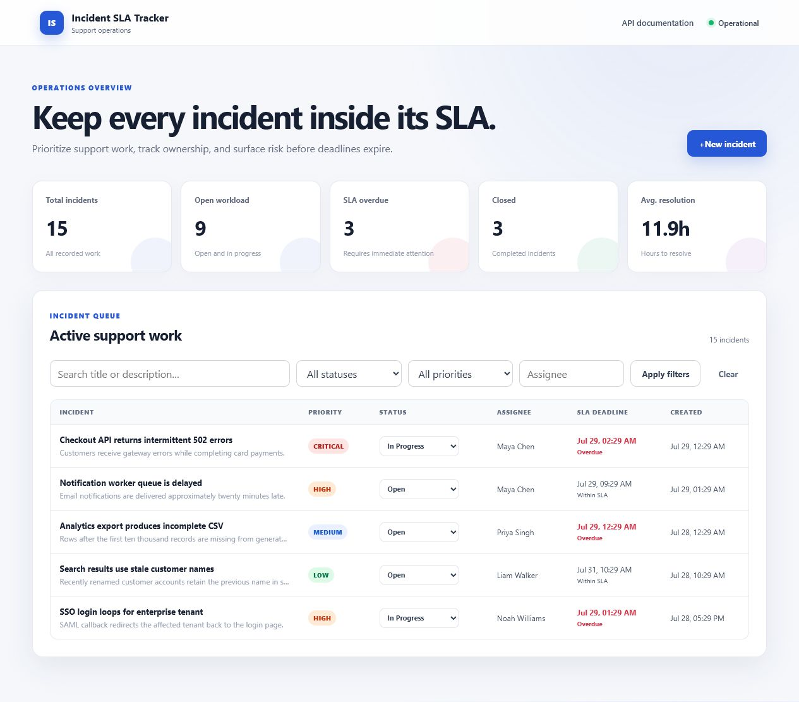
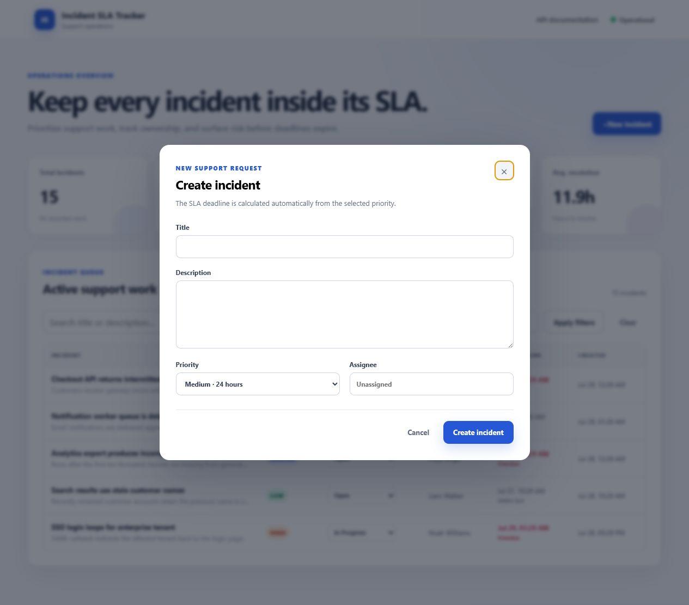
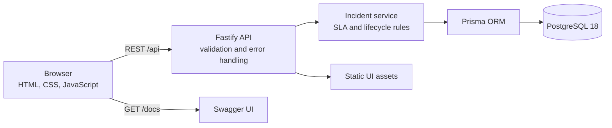
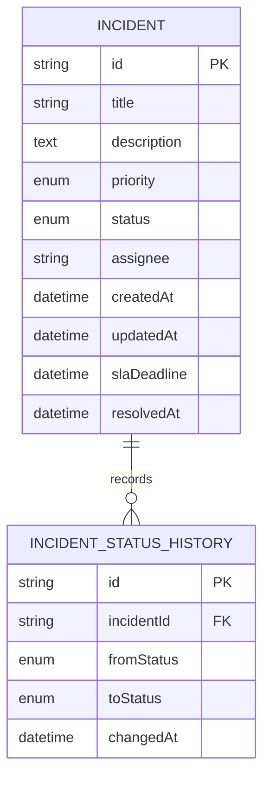

# Incident SLA Tracker

[](https://github.com/German4341374/incident-sla-tracker/actions/workflows/ci.yml)
[](LICENSE)

Add a support incident, choose a priority, and assign someone to it. The app calculates the
SLA deadline and shows which incidents are still open or already overdue.

You can search and filter the list, change statuses, and see the history of each incident.
The dashboard gives you a quick count and the average time to resolve them.

## Features

- Create, read, update and delete support incidents.
- Calculate SLA deadlines automatically: Low 72h, Medium 24h, High 8h, Critical 2h.
- Highlight overdue Open and In Progress incidents.
- Filter by status, priority and assignee; search titles and descriptions.
- Record every status transition with its previous status and timestamp.
- Report total, active, overdue and closed incidents plus average resolution time.
- Validate requests and return one stable JSON error format.
- Explore the API interactively with OpenAPI/Swagger at `/docs`.
- Load a realistic, explicitly invoked demonstration seed with 15 incidents.

## Interface





The screenshots use the repository's UI-only preview data. The normal application reads all
metrics and incidents from PostgreSQL.

## Architecture



The application is intentionally a modular monolith. HTTP concerns live in `src/app.ts`, domain
rules in `src/domain`, lifecycle orchestration in `src/incident-service.ts`, and persistence in
Prisma. This keeps deployment simple without coupling SLA calculations to Fastify or PostgreSQL.

## Data model



PostgreSQL indexes cover `status`, `priority`, `slaDeadline`, `assignee`, and chronological status
history lookups.

## Technology

- Node.js 24 and strict TypeScript
- Fastify 5, Zod and OpenAPI
- PostgreSQL 18 and Prisma 7
- HTML, CSS and browser JavaScript
- Vitest, ESLint and Prettier
- Docker Compose and GitHub Actions

## Prerequisites

- Docker Engine with Docker Compose
- For host development: Node.js 24+ and pnpm 11+
- Windows users should run the commands from WSL2

## Run with Docker

```bash
git clone https://github.com/German4341374/incident-sla-tracker.git
cd incident-sla-tracker
cp .env.example .env
docker compose up --build -d
docker compose run --rm migrate pnpm db:seed
```

Open:

- Application: <http://localhost:3000>
- Swagger UI: <http://localhost:3000/docs>
- Health endpoint: <http://localhost:3000/health>

Stop the stack without deleting data:

```bash
docker compose down
```

Delete the local database volume as well:

```bash
docker compose down --volumes
```

## Host development

Start PostgreSQL through Docker, then run the application on the host:

```bash
cp .env.example .env
docker compose up -d postgres
corepack enable
pnpm install --frozen-lockfile
pnpm db:deploy
pnpm db:seed
pnpm dev
```

`pnpm preview` starts a UI-only documentation preview on port 3200. It does not replace the
PostgreSQL-backed application and must not be used for API testing.

## API examples

Create a Critical incident:

```bash
curl -X POST http://localhost:3000/api/incidents \
  -H 'content-type: application/json' \
  -d '{
    "title": "Checkout API unavailable",
    "description": "Payment requests return HTTP 503.",
    "priority": "CRITICAL",
    "assignee": "Maya Chen"
  }'
```

Filter open High-priority incidents and search their text:

```bash
curl 'http://localhost:3000/api/incidents?status=OPEN&priority=HIGH&search=payment'
```

Move an incident into progress:

```bash
curl -X PATCH http://localhost:3000/api/incidents/INCIDENT_ID \
  -H 'content-type: application/json' \
  -d '{"status":"IN_PROGRESS"}'
```

Read dashboard metrics:

```bash
curl http://localhost:3000/api/dashboard
```

Errors consistently use this envelope:

```json
{
  "error": {
    "code": "VALIDATION_ERROR",
    "message": "Request validation failed",
    "details": [],
    "requestId": "request-correlation-id"
  }
}
```

## Testing and quality

```bash
pnpm format:check
pnpm lint
pnpm typecheck
pnpm test
pnpm build
```

Integration tests require a migrated PostgreSQL database:

```bash
export TEST_DATABASE_URL="$DATABASE_URL"
pnpm test:integration
```

GitHub Actions provisions an isolated PostgreSQL service, applies the committed migration, runs
unit and API integration tests, builds the TypeScript application, and builds the runtime image.

## Project structure

```text
.
├── .github/                 CI, Dependabot and contribution templates
├── docs/                    Architecture and operations notes
├── prisma/                  Schema, migration and 15-incident seed
├── public/                  Minimal browser interface
├── scripts/                 Build and screenshot-preview helpers
├── src/
│   ├── domain/              Pure SLA calculations
│   ├── app.ts               Fastify plugins and REST routes
│   ├── incident-service.ts  Lifecycle and reporting logic
│   └── server.ts            Process startup and graceful shutdown
├── tests/                   Unit and PostgreSQL API integration tests
├── Dockerfile               Multi-stage non-root runtime image
└── docker-compose.yml       Application, migration job and PostgreSQL
```

## Security and operational notes

- The runtime container runs as the unprivileged `node` user with a read-only filesystem and
  `no-new-privileges`.
- Configuration is validated at startup; `.env` files and database state are ignored by Git.
- Query filters are expressed through Prisma rather than string-built SQL.
- Helmet applies security headers and application logs redact common secret fields.
- This portfolio application intentionally has no authentication. Do not expose it directly to
  the public internet without an authentication and authorization layer.

## Possible next steps

- Authentication and per-team authorization for a production deployment.
- SLA pause calendars, business hours, holidays and escalation policies.
- Comments, attachments and outbound email/chat notifications.
- Cursor pagination and saved dashboard views for larger datasets.
- Audit actor identity and soft deletion or retention policies.
- OpenTelemetry traces, Prometheus metrics and alerting.

## Additional documentation

- [Architecture](docs/architecture.md)
- [API and business rules](docs/api.md)
- [Operations and troubleshooting](docs/operations.md)

## License

Licensed under the [MIT License](LICENSE).
