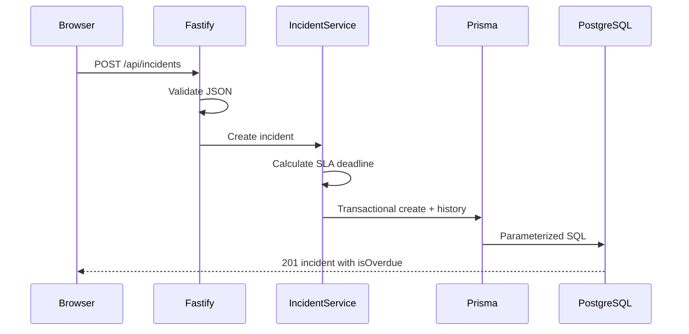

# Architecture

## Decision

Incident SLA Tracker is a modular monolith: one Fastify process serves the browser application and
REST API, while PostgreSQL is the only external runtime dependency.

## Responsibilities

- `app.ts` owns transport concerns, OpenAPI registration, validation and error serialization.
- `incident-service.ts` owns lifecycle rules, status history, filtering and dashboard metrics.
- `domain/sla.ts` is a pure module for deadline and overdue calculations.
- Prisma owns parameterized persistence and migrations.
- `public/` is a framework-free browser client.

## Trade-offs

One service is inexpensive to run and simple to debug. A service layer keeps business logic
extractable if scale later justifies separate workers or APIs. Dashboard calculations use several
indexed queries rather than maintaining counters, which is appropriate for this portfolio-scale
dataset but should be revisited at high write volume.

## Request flow

